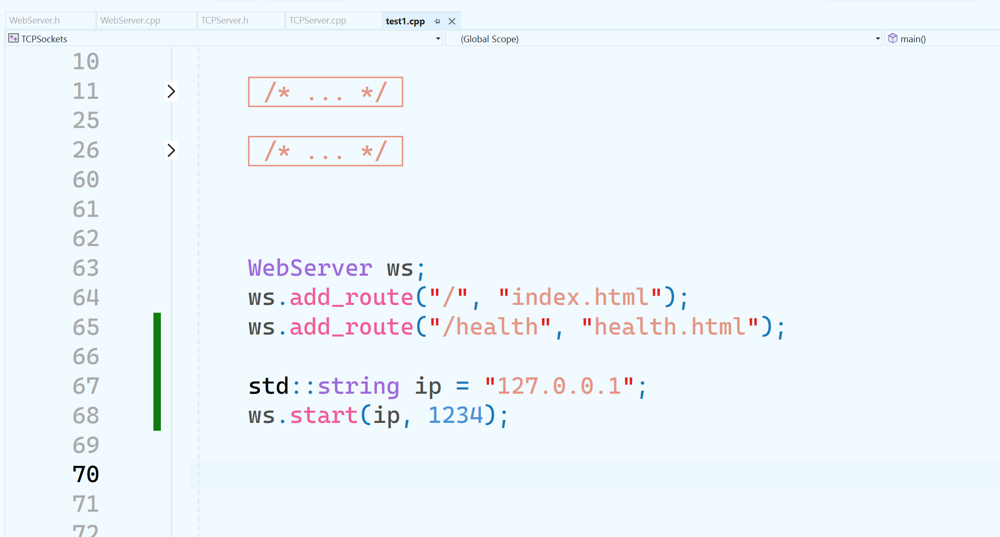
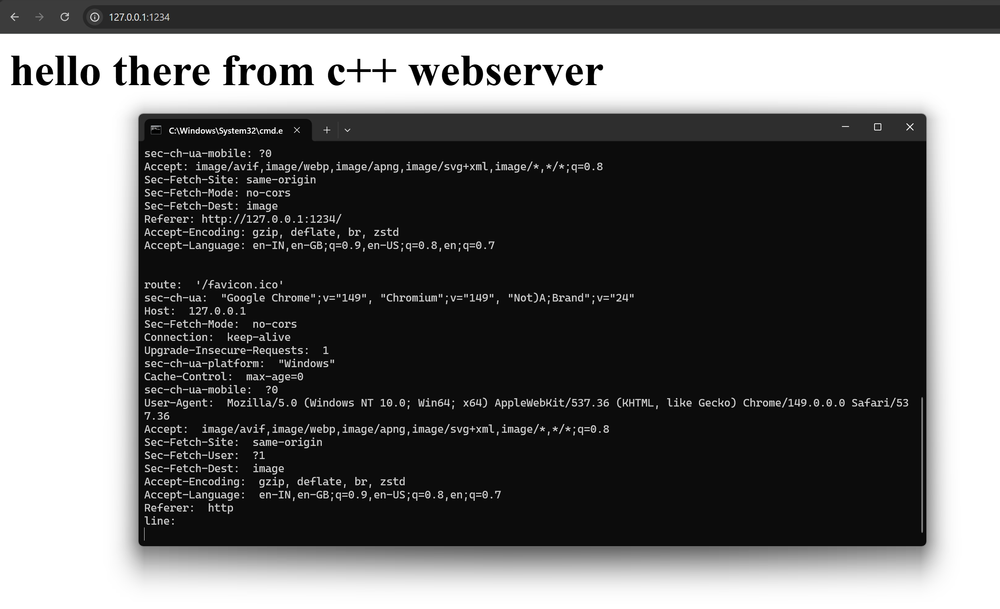
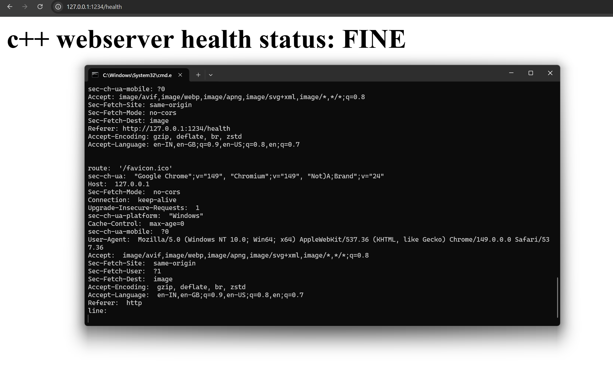

# SimpleWebServer
made simple webserver to practice c++

# External string parsing library
i have used pystring c++ project to parse http request.
- Visual studio -> Add Existing item -> Choose pystring.h, pystring.cpp, pystring_impl.h
- Project Properties -> C++ -> General -> add the pystring folder to "Additional include libraries"

# Usage
## Initialize webserver object
```
WebServer ws;
ws.add_route("/", "index.html");
ws.add_route("/health", "health.html");

std::string ip = "127.0.0.1";
ws.start(ip, 1234);
```





